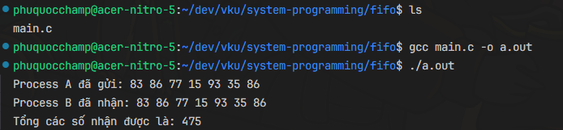

# Truyền Dữ Liệu Giữa Hai Tiến Trình Bằng FIFO

## Mô Tả Bài Toán

Bài tập yêu cầu chúng ta viết một chương trình trong C để thực hiện truyền dữ liệu giữa hai tiến trình:

- **Process A** (hay còn gọi là tiến trình Gửi - Sender) sẽ tạo một chuỗi gồm 7 số nguyên ngẫu nhiên và gửi chuỗi này qua một FIFO.
- **Process B** (hay còn gọi là tiến trình Nhận - Receiver) sẽ nhận các số nguyên từ FIFO, tính tổng của chúng, và in ra kết quả.

**Yêu cầu**: Tiến trình Nhận chỉ đọc dữ liệu sau khi Tiến trình Gửi đã ghi dữ liệu vào FIFO.

## Demo



## Cấu Trúc Chương Trình

Chương trình bao gồm các thành phần chính sau:

- **Tạo FIFO**: Sử dụng `mkfifo()` để tạo một FIFO mới (nếu chưa tồn tại).
- **Process A (Sender)**:
  - Tạo ra một mảng gồm 7 số nguyên ngẫu nhiên.
  - Gửi các số nguyên này qua FIFO.
- **Process B (Receiver)**:
  - Nhận các số nguyên từ FIFO.
  - Tính tổng của các số nhận được và in ra kết quả.
- **Xóa FIFO**: Xóa FIFO sau khi hoàn thành việc truyền dữ liệu.

## Mã Nguồn

Dưới đây là mã nguồn cho chương trình truyền dữ liệu giữa hai tiến trình sử dụng FIFO:

```c
#include <stdio.h>
#include <stdlib.h>
#include <unistd.h>
#include <sys/types.h>
#include <sys/stat.h>
#include <fcntl.h>
#include <string.h>

#define FIFO_NAME "/tmp/myfifo"
#define SIZE 7

void sender_process() {
    int fd;
    int numbers[SIZE];

    // Tạo 7 số ngẫu nhiên
    for (int i = 0; i < SIZE; i++) {
        numbers[i] = rand() % 100;  // Số ngẫu nhiên từ 0 đến 99
    }

    // Mở FIFO để ghi dữ liệu
    fd = open(FIFO_NAME, O_WRONLY);
    if (fd == -1) {
        perror("Không thể mở FIFO để ghi");
        exit(EXIT_FAILURE);
    }

    // Ghi dữ liệu vào FIFO
    write(fd, numbers, sizeof(numbers));
    printf("Process A đã gửi: ");
    for (int i = 0; i < SIZE; i++) {
        printf("%d ", numbers[i]);
    }
    printf("\n");

    // Đóng FIFO
    close(fd);
}

void receiver_process() {
    int fd;
    int numbers[SIZE];
    int sum = 0;

    // Mở FIFO để đọc dữ liệu
    fd = open(FIFO_NAME, O_RDONLY);
    if (fd == -1) {
        perror("Không thể mở FIFO để đọc");
        exit(EXIT_FAILURE);
    }

    // Đọc dữ liệu từ FIFO
    read(fd, numbers, sizeof(numbers));
    printf("Process B đã nhận: ");
    for (int i = 0; i < SIZE; i++) {
        printf("%d ", numbers[i]);
        sum += numbers[i];
    }
    printf("\nTổng các số nhận được là: %d\n", sum);

    // Đóng FIFO
    close(fd);
}

int main() {
    // Tạo FIFO nếu nó chưa tồn tại
    if (mkfifo(FIFO_NAME, 0666) == -1) {
        perror("Không thể tạo FIFO");
    }

    pid_t pid = fork();

    if (pid == -1) {
        perror("Không thể tạo tiến trình con");
        exit(EXIT_FAILURE);
    }

    if (pid == 0) {
        // Tiến trình con - Nhận dữ liệu
        receiver_process();
    } else {
        // Tiến trình cha - Gửi dữ liệu
        sender_process();
    }

    // Xóa FIFO sau khi sử dụng
    unlink(FIFO_NAME);

    return 0;
}
```

## Giải Thích Chi Tiết

1. **Tạo FIFO**:

   - Sử dụng `mkfifo(FIFO_NAME, 0666)` để tạo một FIFO với quyền truy cập `0666` cho phép đọc và ghi.
   - FIFO là một tệp đặc biệt cho phép truyền dữ liệu giữa các tiến trình.

2. **Tiến Trình Gửi (Sender)**:

   - **Tạo mảng số nguyên ngẫu nhiên**: Sử dụng vòng lặp `for` để tạo ra 7 số nguyên ngẫu nhiên trong khoảng từ 0 đến 99.
   - **Gửi dữ liệu**: Mở FIFO để ghi dữ liệu, sử dụng `write()` để gửi toàn bộ mảng số nguyên vào FIFO, sau đó đóng FIFO.

3. **Tiến Trình Nhận (Receiver)**:

   - **Nhận dữ liệu**: Mở FIFO để đọc dữ liệu, sử dụng `read()` để đọc mảng số nguyên.
   - **Tính tổng và hiển thị kết quả**: Tính tổng các số đã nhận và in kết quả.

4. **Xóa FIFO**: Sau khi truyền dữ liệu xong, chúng ta sẽ xóa FIFO để giải phóng tài nguyên.

## Cách Biên Dịch Và Chạy Chương Trình

1. **Biên dịch chương trình**:

   ```bash
   gcc main.c -o a.out
   ```

2. **Chạy chương trình**:

   ```bash
   ./a.out
   ```

Kết quả chạy chương trình sẽ bao gồm hai tiến trình:

- Process A sẽ in ra các số ngẫu nhiên đã gửi.
- Process B sẽ in ra các số nhận được và tính tổng của chúng.
